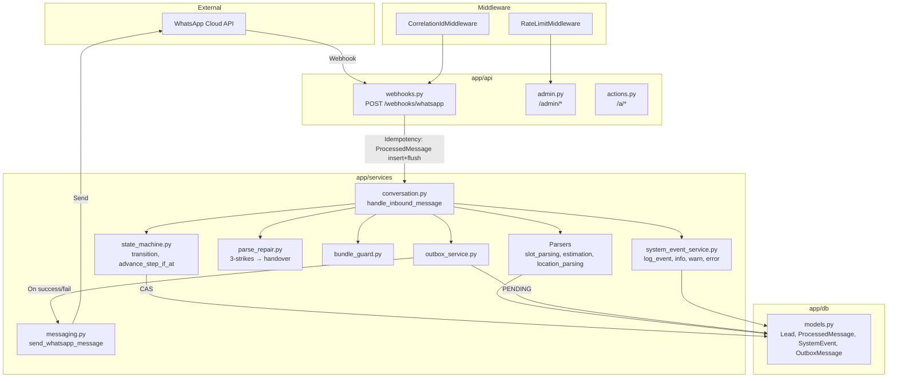

# Architecture Summary and Next Improvements

**Executive summary:** The Tattoo Booking Bot is a FastAPI application that receives WhatsApp messages via webhooks, routes them through a conversation state machine, parses structured inputs (dimensions, budget, location, slot), and persists results to PostgreSQL. Outbound messages go through WhatsApp Cloud API; optionally through an outbox for durability. SystemEvents provide observability and retention cleanup keeps the event table bounded. The parser is instrumented (slot parse metrics), safe (CAS step advance, idempotency, repair→handover), and maintainable (pure parsers + logged wrappers). Core invariants—idempotency early insert+flush, CAS step advance, outbox behavior, repair→handover after N failures, correlation_id propagation—are enforced and tested.

---

## 1) High-Level Architecture Diagram



**ASCII equivalent:**

```
WhatsApp → Webhook (signature verify) → Idempotency (ProcessedMessage insert+flush)
    → get_or_create_lead → handle_inbound_message
        → state_machine (transition, advance_step_if_at) [CAS]
        → parsers (slot, dimensions, budget, location)
        → parse_repair (3-strikes → handover)
        → bundle_guard (multi-answer, wrong-field)
    → DB (Lead, LeadAnswer, ProcessedMessage, SystemEvent)
    → outbox (if enabled) → messaging → WhatsApp send
    → correlation_id propagated (middleware → log_event)
```

---

## 2) Module-by-Module Responsibilities

### app/api

| Module | Responsibility |
|--------|----------------|
| `webhooks.py` | WhatsApp verification, inbound message parsing, signature verification, idempotency (ProcessedMessage), Stripe webhooks, delegation to `handle_inbound_message` |
| `admin.py` | Admin-only endpoints: leads, funnel, metrics, slot-parse-stats, retention cleanup, sweep-expired-deposits, outbox retry |
| `actions.py` | Action token links (approve, reject, etc.) |
| `demo.py` | Demo mode conversation flow |
| `auth.py` | Admin API key auth |

### app/services

| Module | Responsibility |
|--------|----------------|
| `conversation.py` | `handle_inbound_message` — orchestrates state machine, parsing, repair, handover; routes by lead status |
| `state_machine.py` | Status transitions (ALLOWED_TRANSITIONS), `transition` (SELECT FOR UPDATE), `advance_step_if_at` (CAS) |
| `safety.py` | `update_lead_status_if_matches` (atomic status update), `check_processed_event` (idempotency for Stripe/reminders) |
| `slot_parsing.py` | Pure `parse_slot_selection` + `parse_slot_selection_logged`, `get_slot_parse_stats` |
| `estimation_service.py` | `parse_dimensions`, `parse_budget_from_text` |
| `location_parsing.py` | `parse_location_input`, `is_valid_location` |
| `parse_repair.py` | `increment_parse_failure`, `should_handover_after_failure`, `trigger_handover_after_parse_failure` (MAX_FAILURES=3) |
| `bundle_guard.py` | `looks_like_multi_answer_bundle`, `looks_like_wrong_field_single_answer` |
| `outbox_service.py` | `write_outbox`, `mark_outbox_sent`, `mark_outbox_failed`, `retry_due_outbox_rows` (when OUTBOX_ENABLED) |
| `messaging.py` | `send_whatsapp_message` (dry-run, WhatsApp Cloud API) |
| `system_event_service.py` | `log_event`, `info`, `warn`, `error`; `cleanup_old_events`; correlation_id resolution |
| `sheets.py` | `log_lead_to_sheets` (background task) |
| `calendar_service.py` | `get_available_slots` (read-only) |
| `reminders.py` | Qualifying/booking reminders (via external cron) |

### app/db

| Module | Responsibility |
|--------|----------------|
| `models.py` | Lead, LeadAnswer, ProcessedMessage, ActionToken, SystemEvent, OutboxMessage, Attachment |
| `deps.py` | `get_db` — FastAPI dependency |
| `session.py` | `SessionLocal`, engine |
| `base.py` | SQLAlchemy Base |

---

## 3) Key Invariants

These rules must always hold. Violations are logged (SystemEvents) and/or tested.

| Invariant | Rule | Enforcement |
|-----------|------|-------------|
| **Idempotency early insert+flush** | `ProcessedMessage(provider, message_id)` inserted and flushed **before** any processing. Duplicate message_id → return immediately, no side effects. | `webhooks.py` L196–228; `_is_processed_message_unique_violation` |
| **CAS step advance** | `advance_step_if_at` uses `UPDATE leads SET current_step = current_step + 1 WHERE id = ? AND current_step = ?`. rowcount=0 → no double-advance. | `state_machine.py` L304–370; `EVENT_ATOMIC_UPDATE_CONFLICT` |
| **Outbox behavior when enabled** | When OUTBOX_ENABLED: write PENDING row before send; on success mark SENT; on failure mark FAILED + next_retry_at. Retry via admin or job. | `outbox_service.py`; `messaging.py` integration |
| **Repair→handover after N failures** | MAX_FAILURES=3. After 3 parse failures on same field → `trigger_handover_after_parse_failure` → transition to NEEDS_ARTIST_REPLY. | `parse_repair.py`; `_handle_qualifying_lead` |
| **Correlation ID propagated** | Every request gets correlation_id (X-Correlation-ID or generated). Middleware sets contextvar; `log_event`/`info` includes it in payload. | `correlation_id.py`; `system_event_service._resolve_correlation_id` |
| **Status transitions locked** | `transition` uses SELECT FOR UPDATE; re-checks status after lock. Invalid transitions raise ValueError. | `state_machine.py` L237–256 |
| **Atomic status update** | `update_lead_status_if_matches` (Stripe, etc.) uses `WHERE status = expected`. rowcount=0 → log EVENT_ATOMIC_UPDATE_CONFLICT. | `safety.py` |

---

## 4) Well-Built Structures (Top 8)

1. **Pure parser + logged wrapper** — `parse_slot_selection` returns `(index, metadata)` with no side effects; `parse_slot_selection_logged` logs and returns index. Keeps parsing testable and observability explicit.

2. **Idempotency via unique constraint** — `ProcessedMessage(provider, message_id)` inserted before processing; IntegrityError on duplicate → early return. Prevents duplicate handling from webhook retries.

3. **CAS step advance** — `advance_step_if_at` uses conditional UPDATE. No double-advance when concurrent requests hit the same lead.

4. **Repair→handover (3-strikes)** — Centralized in `parse_repair.py`; `parse_failure_counts` JSON on Lead; `should_handover_after_failure`; `trigger_handover_after_parse_failure` sends bridge message and notifies artist.

5. **SystemEvent log_event helper** — All events go through `log_event`/`info`/`warn`/`error`; correlation_id auto-resolved; payload shape consistent. Enforcement test blocks direct SystemEvent instantiation.

6. **Slot parse observability** — `slot.parse_success` (matched_by), `slot.parse_reject_ambiguous` (reason); `get_slot_parse_stats`; retention job documented. Enables production KPIs.

7. **State machine transitions** — `ALLOWED_TRANSITIONS` dict; `transition` validates and locks; `SELECT FOR UPDATE` prevents races. Status semantics documented.

8. **Bundle guard** — `looks_like_multi_answer_bundle`, `looks_like_wrong_field_single_answer` prevent wrong-field and multi-answer advances. One-at-a-time repair flow.

---

## 5) Next Improvement Candidates (Top 8)

Ranked by ROI and risk. Complexity: S = small (<1 day), M = medium (1–3 days), L = large (3+ days).

| # | Improvement | ROI | Risk | Complexity | File Touchpoints |
|---|-------------|-----|------|------------|------------------|
| 1 | **Transaction boundary policy** | High | Medium | M | `conversation.py`, `webhooks.py`, `state_machine.py`, `safety.py` — document and enforce: single transaction per webhook; side effects (WhatsApp, Sheets) after commit. | 
| 2 | **ConversationResult / domain results** | High | Low | M | `conversation.py` — introduce typed `ConversationResult` (status, message, lead_status, metadata) instead of ad-hoc dicts; improves testability and API contracts. |
| 3 | **Outbox for Sheets** | Medium | Low | M | `sheets.py`, `webhooks.py`, `conversation.py` — persist Sheets log intent before API call; retry on failure. New `SheetsOutbox` or extend OutboxMessage with channel. |
| 4 | **Rate limiting** | Medium | Low | S | `rate_limit.py`, `config.py` — already exists for /admin, /a/. Extend to webhooks if needed; document Redis path for scale. |
| 5 | **PII retention/masking** | Low | High (compliance) | L | `models.py`, `system_event_service.py`, admin endpoints, logs — define retention policy; mask PII in SystemEvent payloads; add purge job. |
| 6 | **Indexing considerations** | Medium | Low | S | `models.py`, migrations — add composite `(event_type, created_at)` on system_events if stats queries slow; document index strategy. |
| 7 | **Parse health dashboard** | Medium | Low | M | `slot_parsing.py`, `admin.py` — `GET /admin/parse-health?days=7` aggregating slot/budget/dimensions/location stats. |
| 8 | **Telemetry for dimensions/budget/location** | Medium | Low | M | `estimation_service.py`, `location_parsing.py`, `conversation.py` — add parse_success/parse_repair/parse_reject events; logged wrappers. |

---

## 6) Improvement Detail: Complexity and File Touchpoints

| Improvement | Complexity | Exact File Touchpoints |
|-------------|------------|------------------------|
| **Transaction boundary policy** | M | `app/services/conversation.py` (ensure no commit inside handlers before side effects), `app/api/webhooks.py` (transaction scope), `app/services/state_machine.py` (transition commits), `docs/` (policy doc) |
| **ConversationResult / domain results** | M | `app/services/conversation.py` (return type), `app/api/webhooks.py` (unwrap), `app/api/demo.py`, `tests/` (assert on result shape) |
| **Outbox for Sheets** | M | `app/services/sheets.py` (write intent, retry logic), `app/db/models.py` (optional new table or channel enum), `app/api/webhooks.py` (background task), `app/api/admin.py` (retry endpoint) |
| **Rate limiting** | S | `app/core/config.py` (webhook limits), `app/main.py` (add webhook path), `app/middleware/rate_limit.py` (optional Redis) |
| **PII retention/masking** | L | `app/db/models.py` (Lead, SystemEvent), `app/services/system_event_service.py` (mask in payload), `app/api/admin.py` (PII purge), `app/jobs/` (retention), `docs/` |
| **Indexing considerations** | S | `app/db/models.py` (SystemEvent), `alembic/versions/` (migration for composite index on event_type, created_at) |
| **Parse health dashboard** | M | `app/services/slot_parsing.py` (extend or new `get_parse_health`), `app/api/admin.py` (GET /admin/parse-health) |
| **Telemetry for dimensions/budget/location** | M | `app/services/estimation_service.py`, `app/services/location_parsing.py`, `app/services/conversation.py` (logged wrappers), `app/api/admin.py` (parse-health aggregation) |
