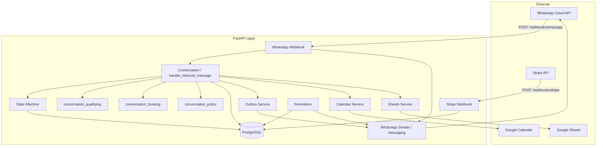
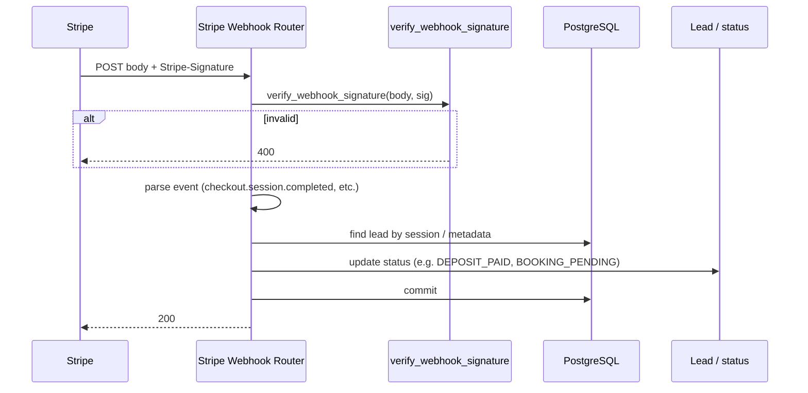
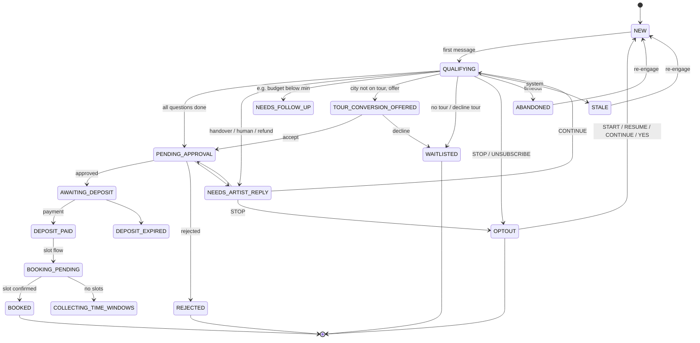

# Architecture Visuals & Engineering Review

Whole-system structure and quality assessment for Tattoo Booking Bot. No refactors—documentation only.

---

## 1. Component diagram



---

## 2. Sequence: WhatsApp inbound message (end-to-end)

```mermaid
sequenceDiagram
    participant WA as WhatsApp
    participant Webhook as Webhook Router
    participant Dedup as ProcessedMessage / Idempotency
    participant Conv as handle_inbound_message
    participant SM as State Machine
    participant DB as PostgreSQL
    participant Outbox as Outbox Service
    participant Send as send_whatsapp_message

    WA->>Webhook: POST body + X-Hub-Signature-256
    Webhook->>Webhook: verify_whatsapp_signature
    alt signature invalid
        Webhook-->>WA: 403
    end
    Webhook->>Dedup: check message_id (ProcessedMessage)
    alt duplicate
        Dedup-->>Webhook: already processed
        Webhook-->>WA: 200 {"received": true, "duplicate"}
    end
    Webhook->>Conv: get_or_create_lead; handle_inbound_message(db, lead, text, dry_run)
    Conv->>SM: transition(db, lead, status) or advance_step_if_at
    SM->>DB: SELECT FOR UPDATE; UPDATE status/step
    Conv->>DB: commit
    Conv->>Outbox: enqueue outbound (or direct send)
    Outbox->>Send: send_whatsapp_message(to, message, dry_run)
    Send-->>WA: HTTP to WhatsApp Cloud API
    Webhook-->>WA: 200 {"received": true, "conversation": {...}}
```

---

## 3. Sequence: Stripe webhook updates lead/status



---

## 4. State / status lifecycle (key STATUS_* transitions)



---

## 5. Module ownership map (conversation split)

```mermaid
flowchart LR
    subgraph Orchestrator
        Router[conversation.py]
    end
    subgraph Qualifying
        Q[conversation_qualifying.py]
    end
    subgraph Booking
        B[conversation_booking.py]
    end
    subgraph Policy
        P[conversation_policy.py]
    end
    subgraph State
        SM[state_machine.py]
    end

    Router -->|dispatch by status| Q
    Router -->|dispatch by status| B
    Q --> P
    B --> P
    Q --> SM
    B --> SM
    Router --> SM

    Router : handle_inbound_message, get_lead_summary
    Q : _handle_new_lead, _handle_qualifying_lead, _complete_qualification, opt-out/human/refund/delete
    B : _handle_booking_pending, _handle_tour_conversion_offered, _handle_needs_artist_reply
    P : is_opt_out_message, is_opt_back_in_message, handover_hold_cooldown_elapsed, etc.
    SM : transition, advance_step_if_at, ALLOWED_TRANSITIONS
```

---

## 6. Import graph (app-internal only)

See **docs/IMPORT_GRAPH.mmd** (generated by `scripts/generate_import_graph.py`). Run from repo root:

```bash
python scripts/generate_import_graph.py
```

---

## 7. Engineering review

### What’s well engineered

- **Seams:** Conversation split (orchestrator vs qualifying vs booking) and pure policy module give clear boundaries and testability.
- **Testability:** Late-binding for `send_whatsapp_message`, re-exports from `conversation.py`, and many unit/integration tests (1000+).
- **Idempotency:** ProcessedMessage dedup at webhook; conditional step advance (`advance_step_if_at`); Stripe/webhook handling avoids double-apply.
- **State machine:** Central ALLOWED_TRANSITIONS + SELECT FOR UPDATE in `transition()` prevent invalid status moves and races.
- **Side-effect ordering:** DB commit before outbound sends in critical paths; outbox pattern where used.

### Footguns / risks

- **Unknown status → NEW:** Orchestrator’s `else` branch sets `lead.status = STATUS_NEW` and restarts without going through `state_machine.transition`. Recovery-only; if a new status is added and not handled, leads silently reset. Mitigation: document, log when hit, consider a test that unknown status is logged.
- **Late-binding fragility:** If a new module imports `send_whatsapp_message` at import time instead of via `_get_send_whatsapp()`, tests that patch `conversation.send_whatsapp_message` can miss it. Mitigation: split-regression test locks this.
- **God modules:** `conversation_qualifying.py` is large (~1000+ lines); still single responsibility but a candidate for future extraction (e.g. handover/refund/delete).
- **Side-effect ordering:** Any new code that sends before commit can violate “commit then send”; review on changes.

### What scales well vs what won’t

- **Scales well:** Single artist, single WhatsApp number, single Stripe account; horizontal scaling of API behind a load balancer; DB connection pooling; idempotency and state machine for consistency.
- **Won’t scale without changes:** Multi-artist (no tenant/artist_id in core flow); multi-channel (only WhatsApp today); very high message volume (outbox and WhatsApp rate limits); running heavy work in request path (e.g. Sheets/Calendar in process).

### Three small recommended improvements (no big refactor)

1. **Log when unknown-status recovery runs:** In the orchestrator `else` branch, log at WARNING with lead id and previous status so ops can spot missing status handling.
2. **Canary mypy:** Run `mypy app/services/conversation_policy.py` (and optionally other pure modules) in CI; keep full `mypy app` as advisory until ORM/test noise is reduced.
3. **More fuzz/edge tests:** Add a few property-style or fuzz tests for slot parsing, budget/dimensions parsing, or policy keywords (invalid/unicode/empty) to harden parsing and policy layers.
